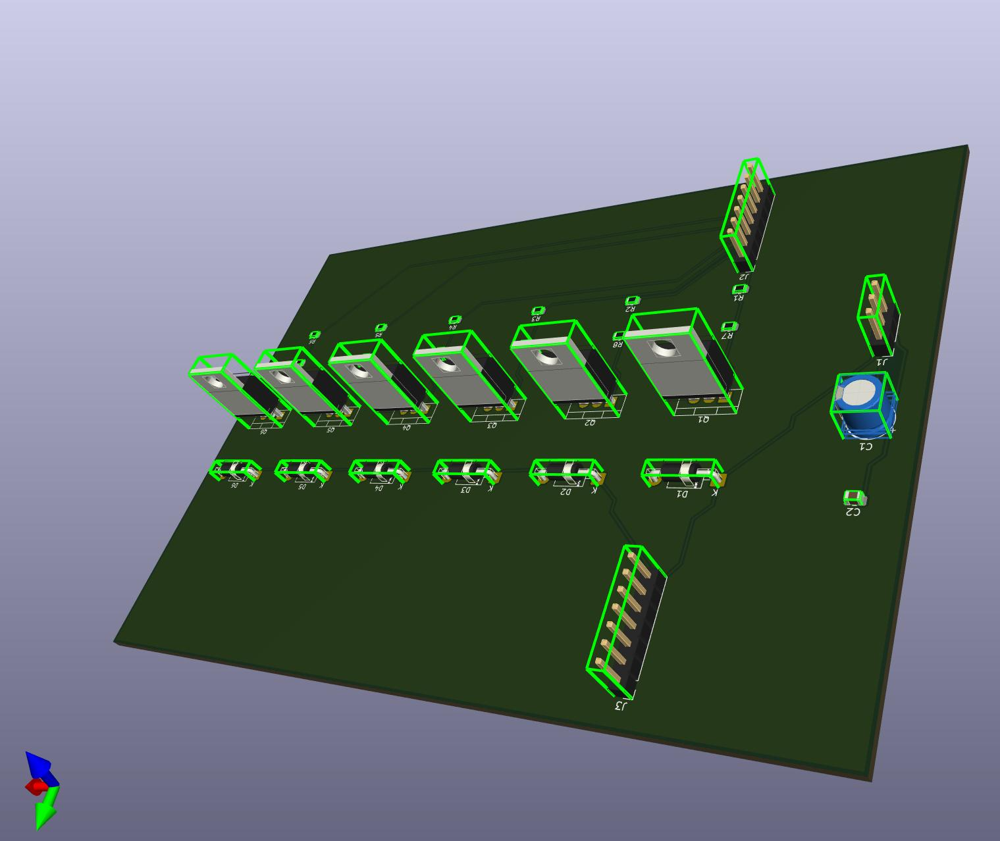

# Pardal PCB

Command-line PCB place & route tool with a Python API and a Mojo backend route path.



## What this project covers

- Python-native board construction and routing workflows
- CLI flows for `build`, `place`, `route`, `drc`, and `repl`
- FreeRouting interop (`freeroute`)
- Mojo backend routing (`backend-route`) using KiCad 9 in Docker for extract/apply

## Requirements

- Python 3.10+
- Docker (required for `backend-route` and `freeroute`)
- KiCad on host is optional for backend-route/freeroute (Docker supplies KiCad 9 there)
- System `pcbnew` is required for `pardal-finalize`

## KiCad compatibility

- Full supported path: KiCad 9 (native or Docker-based tooling)
- Current default backend route path uses Docker image `kicad/kicad:9.0.6-full`
- Older host KiCad versions may still work for limited flows, but are not the full baseline

## Install

```bash
python3 -m venv venv
./venv/bin/pip install -U pip
./venv/bin/pip install -e .
```

Optional global shortcut:

```bash
pip install -e .
pardal --help
```

## CLI quickstart

```bash
# Show commands
./venv/bin/python -m pardal.cli --help

# Build from netlist (+ optional route)
pardal build project.net -p placement.txt -o board.kicad_pcb
pardal build project.net -p placement.txt -o board.kicad_pcb --route

# Route an existing PCB
pardal route board.kicad_pcb -o board_routed.kicad_pcb

# Run DRC
pardal drc board_routed.kicad_pcb --format text

# REPL
pardal repl
```

## Route DSL workflow

The route DSL commands stage artifacts only. They are not release-ready, JLC-ready, or orderable claims.

```bash
# Seed the checked-in example directory
pardal route-dsl example init --example-dir examples/routing_dsl

# Assemble the example artifacts and print the manifest path
pardal route-dsl example run --example-dir examples/routing_dsl

# Pure artifact stages
pardal route-dsl board-ir examples/routing_dsl/board_source.json -o examples/routing_dsl/board.ir.json
pardal route-dsl plan examples/routing_dsl/routes.pdl.yaml examples/routing_dsl/board.ir.json examples/routing_dsl/backend_manifest.json --route-plan-output examples/routing_dsl/route-plan.ir.json --artifact-output examples/routing_dsl/capability-report.json
pardal route-dsl candidates examples/routing_dsl/board.ir.json examples/routing_dsl/route-plan.ir.json examples/routing_dsl/backend_manifest.json -o examples/routing_dsl/route-candidates.json --routes examples/routing_dsl/routes.json

# Apply-to-copy: validate first, then copy input board bytes to the output board path and still write an apply report
pardal route-dsl apply examples/routing_dsl/board.ir.json examples/routing_dsl/route-plan.ir.json examples/routing_dsl/route-candidates.json -o examples/routing_dsl/apply-report.json --selected-candidate-id cand_rg_fpc_escape_a_0001 --input-board input.kicad_pcb --output-board output.kicad_pcb

# fpga-large staged finish-readiness lane
pardal route-dsl fpga-large prepare --work-dir /tmp/pardal-fpga-large
pardal route-dsl fpga-large resume --work-dir /tmp/pardal-fpga-large
pardal route-dsl fpga-large report --work-dir /tmp/pardal-fpga-large
```

## Mojo backend route quickstart

Routes an existing `.kicad_pcb` by extracting with KiCad 9 in Docker, routing on host backend, then applying back with KiCad 9 in Docker.

```bash
pardal backend-route input.kicad_pcb \
  -o output.kicad_pcb \
  --docker-image kicad/kicad:9.0.6-full \
  --cfg tests/fixtures/parity_fixtures/mojo_cfgs/strict_spacing.json \
  --extract-timeout-s 120 \
  --route-timeout-s 120 \
  --apply-timeout-s 120
```

Useful debug artifacts:

- `--problem-json /path/problem.json`
- `--routes-json /path/routes.json`

Deprecated alias:

- `pardal rust-route` (same behavior as `backend-route`, kept for compatibility)

## Python API quickstart

```python
from pathlib import Path
from pardal.board_builder import fpga_board
from pardal.routing_strategies import route_board
from pardal.kicad_writer import KicadWriter

board = (fpga_board(layers=4, width=40, height=40)
    .component("U1", "TQFP-32", (20, 20), value="FPGA")
    .component("C1", "0603", (12, 20), value="100nF")
    .net("VCC", "Power", [("U1", "8"), ("C1", "1")])
    .net("GND", "Power", [("U1", "16"), ("C1", "2")])
    .build())

result = route_board(board, "fpga")
print(f"Routed {result.nets_routed}/{result.nets_total} nets")

KicadWriter().write(board, Path("board.kicad_pcb"))
```

## Atopile handoff (minimal)

```bash
# Use the placed board produced by ato build
pardal route build/builds/default/default/default.kicad_pcb -o board_routed.kicad_pcb

# Optional: backend route instead of Python router
pardal backend-route build/builds/default/default/default.kicad_pcb -o board_routed.kicad_pcb

# Finalization uses system Python + pcbnew
/usr/bin/python3 -m pardal.finalize board_routed.kicad_pcb board_final.kicad_pcb
```

## Finalization

`pardal-finalize` (or `python -m pardal.finalize`) is the production-oriented step that replaces simplified footprints and rebuilds zones using system `pcbnew`.

## Testing

Fast checks:

```bash
./venv/bin/python -m pytest -q tests/test_cli.py tests/test_repl.py tests/test_api_io.py tests/test_route_command.py
./venv/bin/python -m pytest -q tests/integration/test_routing_scenarios.py tests/integration/test_variable_widths.py
```

## Troubleshooting

- `Error: docker permission denied`: ensure your user can access Docker daemon.
- `backend-route timed out`: increase `--extract-timeout-s`, `--route-timeout-s`, and `--apply-timeout-s`.
- Missing backend binary/config behavior: run without `--cfg` first, then add config incrementally.

## License

GNU Affero General Public License v3.0 (AGPL-3.0). See `LICENSE`.
